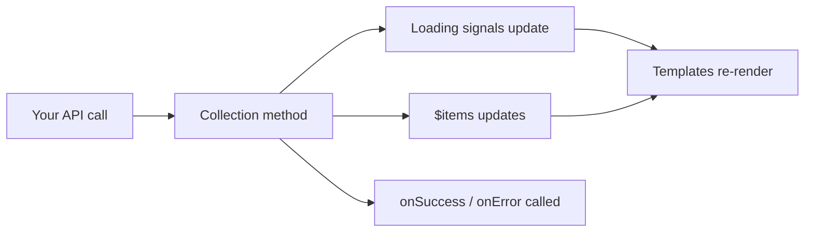

# Core Concepts

## Reactive state via Signals

Every piece of collection state is an Angular Signal. This means:

- Templates that read a signal re-render automatically when the value changes.
- You can derive new signals with `computed()` — for example, filtering items or counting them.
- No manual subscription management is needed for displaying state.

```ts
// In your template:
@if (books.$isReading()) {
  <app-spinner />
}

@for (book of books.$items(); track book.id) {
  <app-book-card
    [book]="book"
    [isSaving]="books.isItemUpdating(book)()"
  />
}

// In your component or store:
readonly availableBooks = computed(() =>
  this.books.$items().filter(b => b.available)
);

readonly bookCount = computed(() => this.books.$items().length);
```

The full list of available signals is in the [State Signals Reference](state-signals.md).

## Immutability

Items in the collection are never mutated in place. Every operation that changes the collection produces a new array. This means:

- Angular change detection works reliably.
- You can safely use `OnPush` change detection everywhere.
- Previous references remain stable — comparing old and new values is meaningful.

When you call `update()`, the old item is replaced with the new one. The original object is never modified.

## Async safety and concurrent operations

One of the most valuable guarantees the library provides is safe handling of concurrent async operations.

Consider this scenario: a user quickly clicks "save" on two different items, while a background refresh is also running. Without careful handling, these overlapping operations could corrupt state, show incorrect loading indicators, or lose updates.

With `Collection`, each operation is tracked independently:

- **Loading flags stay accurate.** `$isUpdating()` remains `true` as long as *any* update is in progress. If two concurrent updates are running and one finishes, the flag stays `true` until the second one completes too.
- **Item-level tracking is precise.** `$updatingItems()` shows exactly which items have in-flight updates. When one item's update finishes, it's removed from the list while others remain.
- **Operations don't interfere.** One failing request doesn't cancel or affect other in-flight operations.

```ts
// Both updates run concurrently — both items appear in $updatingItems()
books.update({ request: api.save(book1), item: book1 });
books.update({ request: api.save(book2), item: book2 });

// In your template, each item independently shows its own spinner:
@for (book of books.$items(); track book.id) {
  <app-book-card
    [book]="book"
    [saving]="books.isItemUpdating(book)()"
  />
}
```

## Request handling

All collection methods accept requests as **Observables** or **Signals**.

Only the first emitted value is used. This means you can safely pass a standard Angular `HttpClient` call (which emits once and completes) without worrying about multiple emissions:

```ts
books.read({
  request: this.http.get<Book[]>('/api/books'),
});
```

If you pass a Signal, its current value is read once at the moment the method executes:

```ts
const data = signal<Book>({ id: 1, title: 'Updated Title', author: 'Author' });

books.update({
  request: data,
  item: { id: 1 },
});
```

## Data flow

Here's how a typical operation flows through the collection:



1. You call a collection method (e.g., `update()`) with a request (your API call) and any callbacks.
2. Loading signals immediately reflect the in-flight operation (`$isUpdating()` becomes `true`, the item appears in `$updatingItems()`).
3. When the request completes, `$items` is updated with the new data.
4. Your `onSuccess` or `onError` callback is called.
5. Loading signals update again (the operation is removed from tracking).
6. Any template reading these signals re-renders automatically.

## The `*Many` methods and partial success

Several methods have `*Many` variants (`createMany`, `readMany`, `updateMany`, `deleteMany`, `refreshMany`) that accept an array of requests. When given an array, each request runs independently:

- Requests that succeed are applied to the collection normally.
- Requests that fail are collected and reported via `onError` (as an array of errors).
- `onSuccess` is called with the items that were successfully processed.

This means a single failed request in a batch doesn't prevent the successful ones from updating the collection. See [Error Handling](error-handling.md) for details.

## Next steps

- [CRUD Operations](crud-operations.md) — detailed guide for every method
- [State Signals](state-signals.md) — all available signals and how they relate
- [Error Handling](error-handling.md) — how errors are reported and tracked
