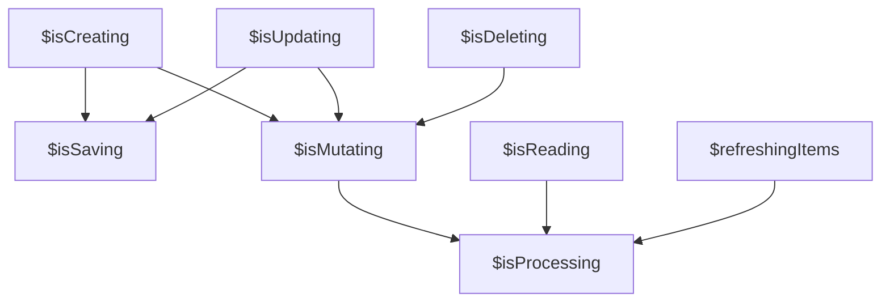

# State Signals Reference

Every piece of collection state is exposed as a readonly Angular Signal. This page documents all public signals and how they relate to each other.

## Collection data

| Signal | Type | Description |
|---|---|---|
| `$items` | `Signal<T[]>` | The current items in the collection. Updated by `read()`, `readOne()`, `readMany()`, `create()`, `update()`, `refresh()`, `delete()`, and their `*Many` variants. |
| `$totalCountFetched` | `Signal<number \| undefined>` | The total count reported by the server via `FetchedItems`. Useful for pagination (e.g., "Showing 10 of 150"). Updated by `read()`, `readMany()`, `refreshMany()`. Can be decremented by `delete()` / `deleteMany()`. |

### Lazy initialization with `$items`

The first time `$items()` is read, an optional callback (set via `setOnFirstItemsRequest()` or the `onFirstItemsRequest` constructor option) fires once in the next microtask. This enables lazy loading — start fetching data only when something actually needs it:

```ts
const collection = new Collection<Product>({
  comparatorFields: ['id'],
  onFirstItemsRequest: () => {
    collection.read({ request: http.get<Product[]>('/api/products') });
  },
});

// No HTTP request yet...

// Later, in a template:
// @for (p of collection.$items(); track p.id) { ... }
// ^ This triggers the first read
```

## Loading flags

These boolean signals indicate whether operations of a given type are in progress. They remain `true` as long as *at least one* operation of that type is running.

| Signal | Type | True when... |
|---|---|---|
| `$isCreating` | `Signal<boolean>` | Any `create()` or `createMany()` is in flight |
| `$isReading` | `Signal<boolean>` | Any `read()`, `readOne()`, or `readMany()` is in flight, or an external `isReading` signal from `readFrom()`/`readManyFrom()` is `true` |
| `$isUpdating` | `Signal<boolean>` | Any `update()` or `updateMany()` is in flight |
| `$isDeleting` | `Signal<boolean>` | Any `delete()` or `deleteMany()` is in flight |
| `$isBeforeFirstRead` | `Signal<boolean>` | No `read()`, `readOne()`, or `readMany()` has completed yet (starts `true`) |

### Composite loading flags

These are derived from the flags above:

| Signal | Composition | Use case |
|---|---|---|
| `$isSaving` | `$isCreating \|\| $isUpdating` | Show a "saving" indicator for write operations |
| `$isMutating` | `$isCreating \|\| $isUpdating \|\| $isDeleting` | Disable a form while any mutation is in flight |
| `$isProcessing` | `$isMutating \|\| $isReading \|\| refreshing` | Show a global activity indicator |



### Template example

```html
<button [disabled]="collection.$isMutating()">
  Save
</button>

@if (collection.$isProcessing()) {
  <app-loading-bar />
}
```

## Item-level tracking

These signals tell you *which specific items* have operations in flight.

| Signal | Type | Populated by |
|---|---|---|
| `$updatingItems` | `Signal<T[]>` | `update()`, `updateMany()` |
| `$deletingItems` | `Signal<T[]>` | `delete()`, `deleteMany()` |
| `$refreshingItems` | `Signal<T[]>` | `refresh()`, `refreshMany()` |
| `$readingItems` | `Signal<Partial<T>[]>` | `read()`, `readOne()`, `readMany()` (when `item`/`items` param provided) |

### Composite item-level signals

| Signal | Composition |
|---|---|
| `$mutatingItems` | `$updatingItems` + `$deletingItems` (deduplicated) |
| `$processingItems` | `$mutatingItems` + `$refreshingItems` (deduplicated) |

## Per-item signal factories

These methods create a `Signal<boolean>` that tracks whether a specific item is in a particular state. They accept either a plain item object or a Signal (for reactive item references that change over time).

| Method | Checks against |
|---|---|
| `isItemUpdating(item)` | `$updatingItems` |
| `isItemDeleting(item)` | `$deletingItems` |
| `isItemRefreshing(item)` | `$refreshingItems` |
| `isItemMutating(item)` | `$mutatingItems` |
| `isItemReading(item)` | `$readingItems` |
| `isItemProcessing(item)` | `$processingItems` + `$readingItems` |

```ts
// With a plain object
readonly isDeleting = this.collection.isItemDeleting(this.book);

// With a Signal (e.g., from a route-based item lookup)
readonly selectedBook = this.collection.getItem(this.routeId);
readonly isSaving = this.collection.isItemUpdating(this.selectedBook);
```

In templates:

```html
@for (book of collection.$items(); track book.id) {
  <div>
    {{ book.title }}
    @if (collection.isItemDeleting(book)()) {
      <span>Deleting...</span>
    }
    <button
      [disabled]="collection.isItemMutating(book)()"
      (click)="deleteBook(book)"
    >
      Delete
    </button>
  </div>
}
```

## Error signals

These signals capture error details from read and refresh operations.

| Signal | Type | Set by |
|---|---|---|
| `$lastReadError` | `Signal<LastError<T> \| undefined>` | `read()` on failure |
| `$lastReadOneError` | `Signal<LastError<T> \| undefined>` | `readOne()` on failure |
| `$lastReadManyError` | `Signal<LastError<T> \| undefined>` | `readMany()` on failure (including partial failures) |
| `$lastRefreshError` | `Signal<LastError<T> \| undefined>` | `refresh()` or `refreshMany()` on failure (including partial failures) |

Each error signal is cleared at the start of a new call to its corresponding method, and set if the request fails. See [Error Handling](error-handling.md) for details on `LastError` and error lifecycle.

## Status signals

| Signal | Type | Description |
|---|---|---|
| `$status` | `Signal<Map<UniqueStatus, T>>` | Unique statuses — each status maps to exactly one item |
| `$statuses` | `Signal<Map<T, Set<Status>>>` | Item statuses — each item can have multiple statuses |

See [Status Management](status-management.md) for details.

## Next steps

- [CRUD Operations](crud-operations.md) — the methods that update these signals
- [Error Handling](error-handling.md) — understanding error signals
- [Status Management](status-management.md) — using `$status` and `$statuses`
